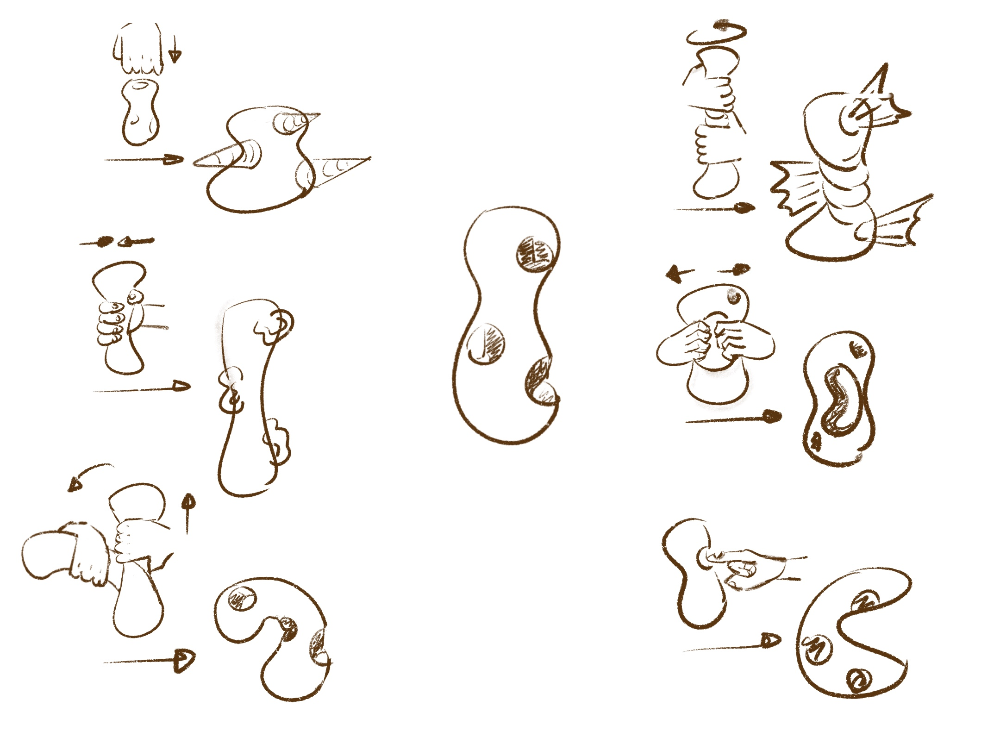

## synaesthetic orchestra

How shapes and colours could sound, or invertedly, which visual form a certain sound takes on, is for many of us an enigma which requires a vivid imagination and translational capacities. For those that experience the neurological condition of synaesthesia, these processes occur naturally, producing a simultaneity of auditory and visual perception (amongst other combinations of senses). Often, synaesthetes report an intrinsically consistent mapping of stimuli, in the sense that the musical note A to them always corresponds to a scarlet triangle. Individuals, however, seldom agree on their subjective experiences, demonstrated by the famous dispute between composers Franz Liszt and Nikolai Rimsky-Korsakov regarding the colours of musical keys.

This preludes the question of the different ways in which form and colour can be translated into sound. The exploration of such mappings lies at the heart of **synaesthetic orchestra**. Through experimentation with varying sounds, aesthetics and translations ranging from intuitive to analytical, an audiovisual AR orchestra should ultimately emerge.

In the implementation, each musician receives a 3D, AR object displayed on a tablet or smartphone. Similarly to a piece of clay, it can be modelled through swiping; stretching, twisting, bending or altering colouration. The shape and colour of each individual's object changes the spatial sound, adding to the composition. The collective piece is simultaneously displayed in the form of a wall projection showing the unity of all contributing AR geometries. The result is a merging of personal, "synaesthetic" experiences into an immersive, collaboratory installation.

### Gestures

**One finger:**
- swipe left to right / right to left
- swipe up to down / down to up
- tap on screen

**Two fingers:**
- move in opposite directions
- move towards each-other
- spiral
- hold one finger down pull to a direction with the other

**Three fingers:**
- twist
- pull in three different directions (triangle)
